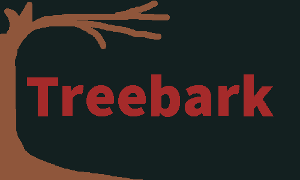
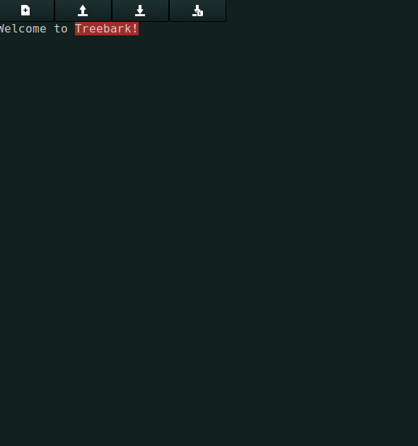

Treebark Text Editor
======================


+ Version: 1.0.2
+ Author: ImperialOfficer324
+ Created: 2021

Description
-----------
Treebark is a fast and simple text editor written in c. It uses the gtk3 toolkit.

## Features
+ Write and read text files
+ Completely Customize your editor with CSS

## Treebark In Action
*Note:* All screenshots are taken with the default GTK theme applied and ePapyrus icons.


## Installation
Treebark can be installed in 3 ways.
1. Install with Git
2. Full Download
3. Build from Source


Each of the methods is detailed below.

**Note:** as well as specific dependencies for each download method, you will always need the gtk widget set to be installed. See instructions here: https://riptutorial.com/gtk3/example/14881/installation-or-setup

## Install with Git
**Why this Method?** Installing with git allows you to reuse the same installer for multiple installs and saves you the hassle of going to a browser for every update.

**Requirements:** To use this method, you must have git installed on your system. You will also need make and the gtk+ dev libraries for C, so that the installer can build the program for you.

1. Download the latest version of the Treebark Installer
2. Unzip the archive
3. From the new Directory (TreebarkInstaller), run the installer executable
4. Click through the installer. When prompted to select installation method, select Install with Git
5. Finish Installation

## Full Download

**Why this Method?** This method is a clean install without you needing to build the executables. This leads to a more stable installation process.

**Requirements:** No additional requirements

1. Download the latest version of teh Treebark Full Download
2. Unzip the Archive
3. From the new directory (Treebark), run ./build/installer
4. Click through the installer. When prompted to select installation method, select Install from predownloaded resources
5. Finish Installation

## Build from Source

**Why this Method?** This method is great if you want to edit the source code yourself.

**Requirements:** To use this method you must have make and the gtk+ development libraries for C

1. Clone or download the repository
2. cd into the source/ directory
3. run make from a terminal
4. cd into the installer/ directory
5. run make from the terminal
6. cd back to the root directory and run ./build/installer
7. From the new directory (Treebark), run ./build/installer
8. Click through the installer. When prompted to select installation method, select Install from predownloaded resources
9. Finish Installation

## The Configuration File
Your treebark configuration file controls how the application functions. It is located at ```~/.config/treebark/config.txt```. You can write any plain text you want in this file, as long as no lines start with a ```#``` character. Such lines define variables. The syntax for setting variables is:
```#<variable-name>:<variable-value>```. For example, to set the theme to the treebark retro style you could add the line ```#theme: treebark_retro```. As the application develops, more and more variables will become available.

## Changing Theme
In Treebark, you can easily change the style css file that the application reads from. This file includes styling for the application and keybinding configuration. It is not recommended to edit any of the default themes shipped with Treebark, but rather make copies and set the theme variable(see above) to the name of your new file. Below are two different examples of ways to edit the theme.

**Editing Keybindings:** Let's say that, for some reason, you wanted to save your file with Control+F instead of Control+s. This is very easy. Open a theme file, and find(or create) a block that looks like this:
  ```css
  @binding-set EditorTools
  {
    bind "<Control>v" {"paste-clipboard" ()};
    bind "<Control>c" {"copy-clipboard" ()};
    bind "<Control>n" {"new-file" ()};
    bind "<Control>o" {"open-file" ()};
    bind "<Control>s" {"save-file" ()};
    bind "<Control><Shift>s" {"save-file-as" ()};
  }
  ...
  
  .text-editor{
  ...
    -gtk-key-bindings:EditorTools;
  ...
  }
  ```
  Change the line ```bind "<Control>s" {"save-file" ()};``` to ```bind "<Control>f" {"save-file" ()};```. Save the file and run Treebark. When you press Control and f, your file should save.
  
**Rounded Buttons:** A useful attribute in css is ```border-radius```, which allows you to change how rounded objects are. Open your style file, and find this block:
```css

.toolbar-button{
    border-radius: 3px;
    ...
    }
```
Change 3px to a larger number, such as 10px. Save the file and launch Treebark. The buttons on the top toolbar should be rounded.

## Reporting Issues
If you have any problems with the installer, application, configuration, please add an issue explaining exactly what you were doing at the time of the problem, and provide screenshots if possible.

## Planned Changes

The following is an incomplete, ever changing list of the planned changes to Treebark.

1. About Page
2. Tabs (open multiple files)
3. Syntax Highlighting
4. Menus
